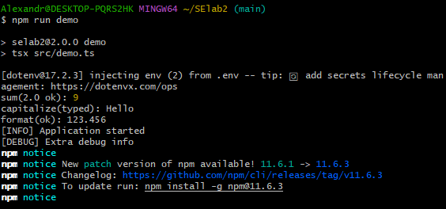
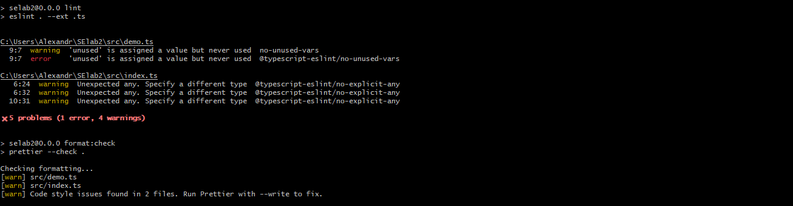
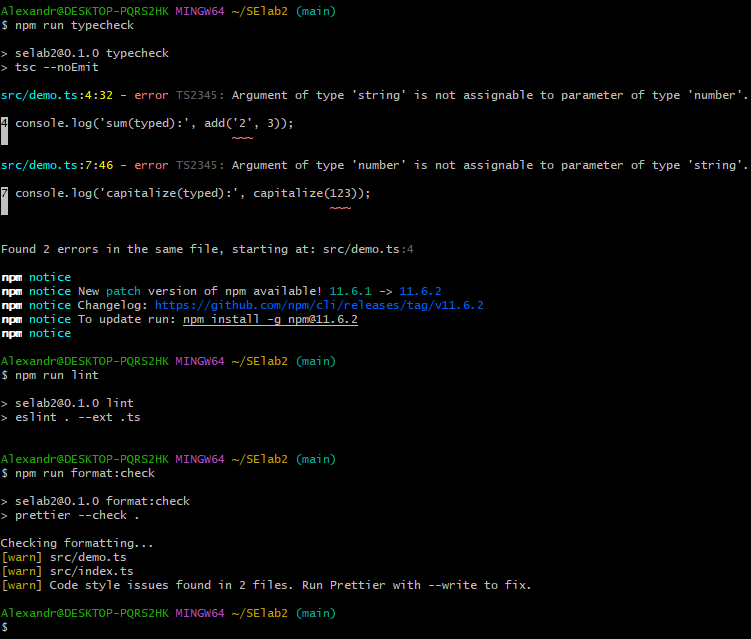
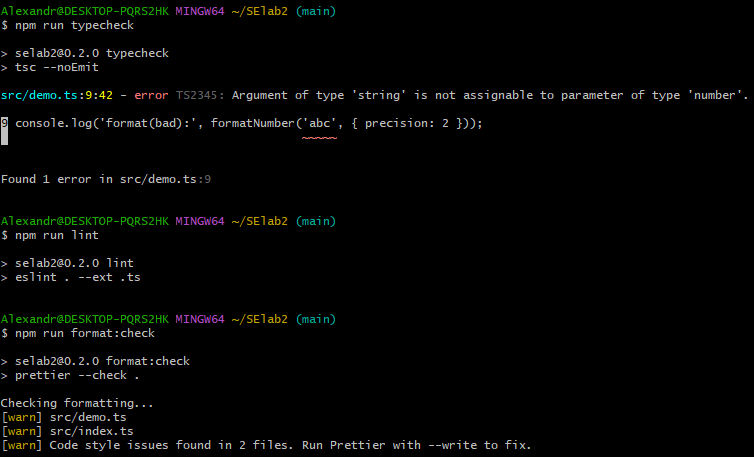
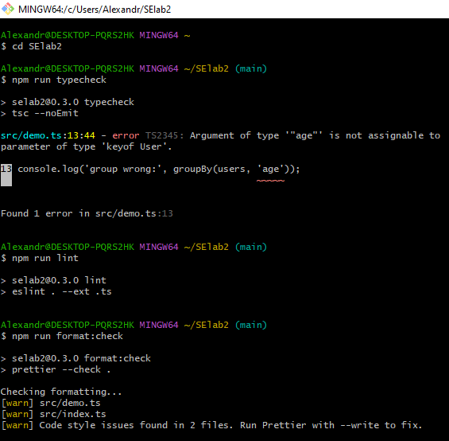
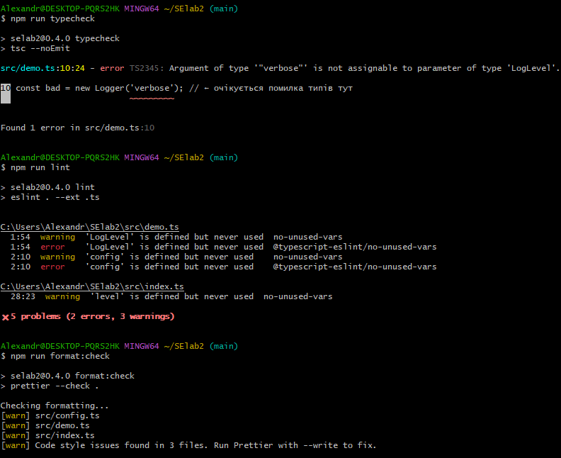
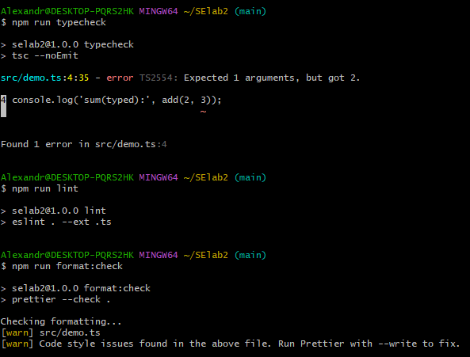

# Лабораторно-практична робота №2

## Опис призначення бібліотеки

### Невелика TypeScript-бібліотека із суворими вимогами до якості коду: використання ESLint, Prettier, Husky, Commitlint, Semantic Versioning та збірки через tsup. 
### Бібліотека містить набір утилітарних функцій — від базових операцій до роботи з логуванням, форматуванням і конфігурацією.

## Інструкції з запуску: npm i, npm run demo, npm run build.

### npm install
### npm run demo -> запуск прикладів з src/demo.ts
### npm run build -> збірка ESM + CJS у dist/

## Огляд кроків еволюції

### 0.1.0
Додано перші функції (add та capitalize) з типами any.

### 0.2.0
Прибрано any, додано коректні типи параметрів.

### 0.3.0
Додано formatNumber із підтримкою NumberFormatOptions.

### 0.4.0
додано інтерфейс і функцію groupBy

### 0.5.0
Додано .env + zod.

Додано клас Logger.

### 1.0.0
Додано пакетні exports.

Заборонено any (ESLint rule).

### 2.0.0
Функція add тепер приймає масив чисел:

## Приклади використання функцій

### Приклади використання функцій з demo.ts

## Нотатка про .env

### APP_PRECISION

Тип: число

Опис: Кількість знаків після коми, яку використовують функції форматування чисел.

Приклад:

APP_PRECISION=3

→ formatNumber(123.45678) → 123.457

### LOG_LEVEL

Тип: рядок

Допустимі значення:

debug — показує всю інформацію (debug + info)

info — лише інформаційні повідомлення

warn — попередження

error — тільки помилки

Приклад:

LOG_LEVEL=debug

## Посилання на теги релізів.

https://github.com/SashaZayets/SElab2/tags

# Демонстрація перевірок

## Навмисна помилка в версії 0.1.0

## Навмисна помилка в версії 0.2.0

## Навмисна помилка в версії 0.3.0

## Навмисна помилка в версії 0.4.0

## Навмисна помилка в версії 0.5.0

## Навмисна помилка в версії 2.0.0

